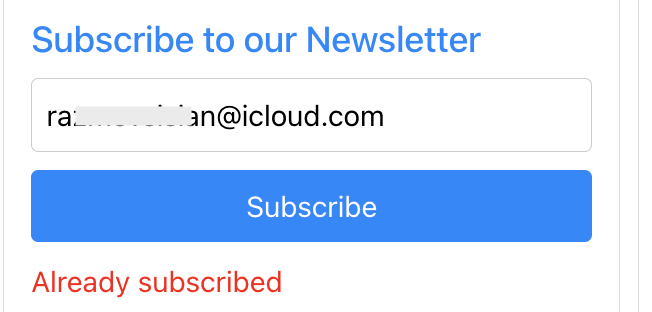
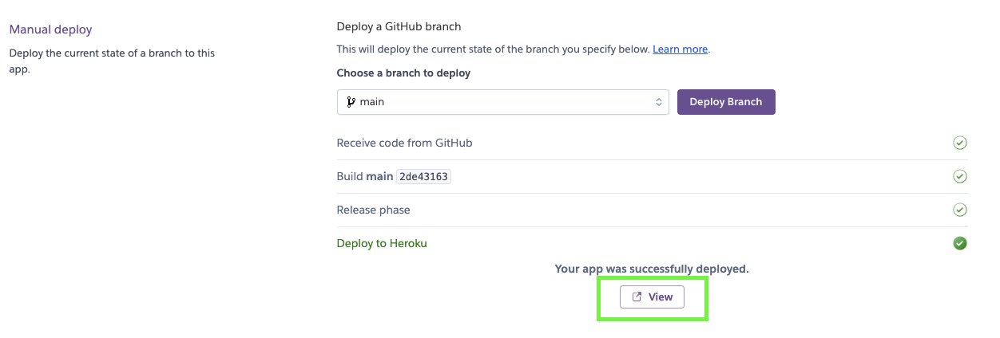
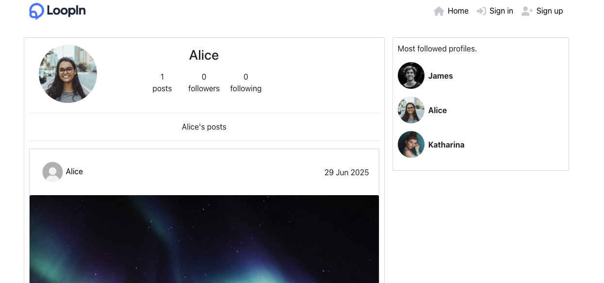

# **Loopin**

[Click here to go to the Live Project](https://loopinapp-d364a1b22906.herokuapp.com/)


[Backend Github](https://github.com/RazmikMovsisyan/drf-api)

[Backend Heroku](https://loopin-8006788e0f02.herokuapp.com/)

Welcome to **Loopin** – a community platform to share photos and stay in the loop!

Loopin is a modern, responsive full-stack web application designed to empower users to express themselves through short, concise blog posts—similar to old skool instagram. Built with Django and a relational database, Loopin enables users to share thoughts, and interact with content in a dynamic, community-driven environment.

The platform offers essential features such as user registration, authentication, and role-based access, allowing different levels of interaction based on user status. Authenticated users can create, read, update, and delete posts, while also exploring content from the wider user base. Comments help foster engagement, turning the app into a vibrant space for digital expression.

The design prioritizes accessibility, user experience, and mobile responsiveness, ensuring the site is intuitive and enjoyable to use on all devices. Loopin was developed using Agile methodologies, with clearly defined user stories guiding its functionality and interface.

Whether you want to share daily updates, thoughts, or start discussions, Loopin provides a lightweight, social experience tailored for small content creators.

The goal is to promote authentic user interactions and community discussions through a well-structured and secure full-stack platform.

---

## **Table of Contents**
- [Loopin](#loopin)
  - [Planning](#planning)
    - [Features](#features)
    - [Used Technologies](#used-technologies)
    - [App Owner Goals](#app-owner-goals)
    - [User Stories](#user-stories)
  - [Design](#design)
    - [Typography](#typography)
    - [Color Scheme](#color-scheme)
  - [User Stories (prioritized using MoSCoW method)](#user-stories-prioritized-using-moscow-method)
  - [Custom Model](#custom-model)
  - [Testing](#testing)
    - [Manual Testing](#manual-testing)
    - [Bugs](#bugs)
  - [Code Validation](#code-validation)
  - [Deployment](#deployment)
    - [Heroku](#heroku)
  - [Version Control](#version-control)
  - [Development Process and Git Commands](#development-process-and-git-commands)
  - [Clone and Fork](#clone-and-fork)
  - [Custom 404 Page](#custom-404-page)
  - [Credits](#credits)
  - [FinishedProduct](#finished-product)


---

## **Planning**

### **Features**
- User authentication and role-based access.
- Post creation with Markdown support.
- Commenting functionality.
- Admin dashboard for managing users and posts.
- Responsive design and accessibility-compliant interface.

### **Used Technologies**
- React, Django Rest Framework, PostgreSQL
- HTML5, CSS3, JavaScript
- Django AllAuth (authentication)
- Cloudinary (image hosting)
- Heroku (deployment)
- Git & GitHub (version control)
- Markdown (documentation)

---

### **App Owner Goals**
- Provide a safe and friendly platform.
- Enable easy post interaction through comments.
- Allow administrators to moderate content.
- Provide clear UX/UI feedback to users at every step.

---

### **User Stories**

# Authentication & Account Management
- **Sign Up:** As a user, I want to create an account so I can access exclusive features.
- **Sign In:** As a user, I want to sign in to access my account features.
- **Login Status:** As a user, I want to easily check if I am logged in.
- **Token Refresh:** As a user, I want my login session to stay active until I log out.
- **Login Options for Guests:** As a logged-out user, I should see options to sign in or create an account.
- **Edit Profile:** As a logged-in user, I can update my profile picture and bio.
- **Change Username & Password:** As a logged-in user, I can change my username and password to keep my account secure.

# Navigation & User Experience
- **Navbar:** As a user, I want a visible navbar across all pages for easy navigation.
- **Routing:** As a user, I want seamless page transitions without refreshing.
- **Infinite Scroll:** As a user, I want to scroll through posts continuously without clicking "next page."

# Posts & Interactions
- **Create Post:** As a logged-in user, I can create posts to share my images.
- **View Post:** As a user, I can view individual posts to learn more about them.
- **Like Post:** As a logged-in user, I can like posts to show my support.
- **Add Comment:** As a logged-in user, I can comment on posts.
- **View Comments:** As a user, I can read comments on posts.
- **Comment Timestamp:** As a user, I can see when a comment was made.
- **Edit Post:** As a post owner, I can edit my post's title and description.
- **Edit Comment:** As a comment owner, I can edit my comment.
- **Delete Comment:** As a comment owner, I can delete my comment.

# Profiles & Social Interaction
- **User Profile:** As a user, I can view other users' profiles to see their posts.
- **User Stats:** As a user, I can view stats like posts, follows, and bio on a profile.
- **Follow/Unfollow Users:** As a logged-in user, I can follow or unfollow users to customize my feed.
- **View Posts of Followed Users:** As a logged-in user, I can view posts from users I follow.
- **Top Profiles:** As a user, I can see the most followed profiles.

# User Avatars & Personalization
- **User Avatars:** As a user, I want to see avatars for other users to make it easier to identify them.


| **Original Story Title**       | **Included** |
|-------------------------------|---------------|
| **Edit and Delete a Post**    | ✅             |
| **Comment on Post**           | ✅             |
| **User Profile Page**         | ✅             |
| **User Registration**         | ✅             |
| **User Login/Logout**         | ✅             |
| **Delete Post**               | ✅             |
| **Edit Post**                 | ✅             |
| **View Posts**                | ✅             |
| **Create Post**               | ✅             |


---

# **Design**

### Typography
The main body font for the app was chosen to use the native font of the user's operating system, ensuring a seamless and familiar user experience. This is achieved through a fallback list that includes common system fonts like -apple-system (for macOS) and Segoe UI (for Windows). For code blocks and source text, the font source-code-pro is used, also secured with a fallback list.

### Color Scheme


The core color scheme consists of three main colors: a light blue (#1486fe) for hover states, a neutral gray (#cfced3) for non-hover states, and black for certain buttons. I also included some minor exceptions for special elements, such as the sign-in and sign-up buttons, which use a brighter blue (#2ed9ff) and a dark blue (#2142b2) to help them stand out from the rest of the design.


## **User Stories (prioritized using MoSCoW method)**

## Project Overview
A responsive web application allowing users to sign up, create posts, interact with content, and follow other users. Built with modern frontend and backend technologies to ensure a seamless user experience.

## User Stories (prioritized using MoSCoW method)

I consistently choose to follow the MoSCoW prioritization method in [my projects](https://github.com/users/RazmikMovsisyan/projects/6) because it brings unparalleled clarity, focus, and direction to the development process. 
By categorizing features into Must-haves, Should-haves, Could-haves, and Won't-haves, 
I’m able to clearly distinguish between what’s absolutely essential for the project’s success and what can wait for future iterations. 
This approach helps me manage scope effectively, avoid feature creep, and ensure that the core functionality the Minimum Viable Product is delivered on time and meets user expectations. 
It also facilitates better communication with stakeholders, as everyone has a shared understanding of what will be built and why. 
Most importantly, [MoSCoW](https://github.com/users/RazmikMovsisyan/projects/6) allows me to stay agile, adapt to changes, and continuously deliver value without getting lost in unnecessary complexity. 
That’s why I rely on it as it turns vision into actionable, prioritized progress.


### Must Have

#### User Registration
**As a** new visitor, **I can** register for an account **so that** I can access exclusive features.
- **AC1:** When I provide valid registration details, I am successfully registered
- **AC2:** I am automatically logged in after registration
- **AC3:** I receive visual confirmation of successful registration

#### User Login/Logout
**As a** registered user, **I can** log in and log out **so that** I can access my account securely.
- **AC1:** I can log in with correct credentials
- **AC2:** I can log out with one click
- **AC3:** My login state is visibly indicated throughout the application

#### Create Post
**As a** logged-in user, **I can** create posts **so that** I can share my images with others.
- **AC1:** I can submit a post with image and description
- **AC2:** After submission, the new post appears in the feed
- **AC3:** The post is also visible on my profile

#### View Posts
**As a** user, **I can** view individual posts **so that** I can learn more about them.
- **AC1:** I can click on any post to view its details
- **AC2:** Each post displays the image, description, and engagement metrics
- **AC3:** Comments are visible on the post detail page

#### Like Posts
**As a** logged-in user, **I can** like posts **so that** I can show my support.
- **AC1:** I can like/unlike posts with a single action
- **AC2:** The like count updates immediately after my action
- **AC3:** My liked state is visually indicated

#### Add Comments
**As a** logged-in user, **I can** comment on posts **so that** I can join conversations.
- **AC1:** I can submit comments on any post
- **AC2:** My comment appears immediately under the post
- **AC3:** Comments display my username and avatar

#### Basic Navigation
**As a** user, **I want** a visible navbar across all pages **so that** I can easily navigate the application.
- **AC1:** The navbar is consistently present on all pages
- **AC2:** Navigation occurs without full page refresh
- **AC3:** The navbar adapts based on login state

### Should Have

#### Infinite Scroll
**As a** user, **I want** to scroll through posts continuously **so that** I can browse content seamlessly.
- **AC1:** New content loads automatically when I reach bottom of page
- **AC2:** Loading indicators appear when new content is being fetched

#### Edit Profile
**As a** logged-in user, **I can** update my profile picture and bio **so that** I can personalize my presence.
- **AC1:** I can access profile editing from my profile page
- **AC2:** Changes are saved and immediately visible
- **AC3:** I receive confirmation of successful update

#### Follow/Unfollow Users
**As a** logged-in user, **I can** follow or unfollow users **so that** I can customize my feed.
- **AC1:** I can follow/unfollow with a single action
- **AC2:** My follower/following counts update immediately
- **AC3:** The button state changes to reflect my follow status

#### View User Profiles
**As a** user, **I can** view other users' profiles **so that** I can see their posts and statistics.
- **AC1:** I can click on usernames to view profiles
- **AC2:** Profiles display user information and post history
- **AC3:** Stats (posts, followers, following) are visible

#### Edit/Delete Own Content
**As a** content owner, **I can** edit or delete my posts and comments **so that** I can manage my content.
- **AC1:** Edit/delete options are only visible on my own content
- **AC2:** Editing opens a form with existing content pre-filled
- **AC3:** Deletion requires confirmation before proceeding

### Could Have

#### Token Refresh
**As a** user, **I want** my login session to stay active **so that** I don't get logged out unexpectedly.
- **AC1:** My session persists during active use
- **AC2:** I remain logged in until I explicitly log out

#### Top Profiles Section
**As a** user, **I can** see the most followed profiles **so that** I can discover popular accounts.
- **AC1:** A "Top Profiles" section is visible somewhere in the application
- **AC2:** Profiles are ordered by follower count

#### Comment Timestamps
**As a** user, **I can** see when a comment was made **so that** I can understand conversation context.
- **AC1:** Each comment displays its creation time
- **AC2:** Timestamps use a relative format (e.g., "2 hours ago")

### Won't Have (for now)

#### Post Categories or Hashtags
**As a** user, **I cannot** categorize posts or use hashtags **because** this feature is out of scope for the initial release.
- **AC1:** No UI elements exist for adding categories or hashtags to posts
- **AC2:** The post creation form does not include hashtag input fields
- **AC3:** Search or filtering by categories/hashtags is not available

#### Direct Messaging Between Users
**As a** user, **I cannot** send direct messages to other users **because** private messaging functionality is not implemented.
- **AC1:** No messaging interface or inbox is available in the navigation
- **AC2:** User profiles do not contain "Send Message" buttons
- **AC3:** Real-time chat functionality is completely absent from the application

## **Custom Model**
## Newsletter Feature Implementation - LoopIn
---

## Overview
The newsletter feature allows users to subscribe and unsubscribe from a newsletter without email confirmation. It is integrated into the LoopIn social media platform.

---

## Backend Implementation

### Model Creation
I created a `NewsletterSubscriber` model to store subscriber information.

**File: newsletter/models.py**
```python
from django.db import models
import uuid

class NewsletterSubscriber(models.Model):
    email = models.EmailField(unique=True)
    subscribed = models.BooleanField(default=True)
    created_at = models.DateTimeField(auto_now_add=True)
    confirmation_code = models.CharField(max_length=40, unique=True, default=uuid.uuid4)

    def __str__(self):
        return self.email
```

### API Endpoints
I implemented three API endpoints:

- `POST /newsletter/subscribe/`: Subscribe an email to the newsletter.
- `POST /newsletter/unsubscribe_by_email/`: Unsubscribe an email by providing the email address.
- `POST /newsletter/unsubscribe/<uuid:code>/`: Unsubscribe using a confirmation code.

### Views
**File: newsletter/views.py**

The subscribe view handles subscription and returns appropriate messages.

```python
@api_view(['POST'])
def subscribe(request):
    email = request.data.get('email')
    if not email:
        return Response({'error': 'Email is required'}, status=status.HTTP_400_BAD_REQUEST)
    
    if NewsletterSubscriber.objects.filter(email=email, subscribed=True).exists():
        return Response({'error': 'Already subscribed'}, status=status.HTTP_400_BAD_REQUEST)
    
```

The unsubscribe_with_email view handles unsubscription by email and deletes the record.

```python
@api_view(['POST'])
def unsubscribe_with_email(request):
    email = request.data.get('email')
    if not email:
        return Response({'error': 'Email is required'}, status=status.HTTP_400_BAD_REQUEST)
    
    try:
        subscriber = NewsletterSubscriber.objects.get(email=email)
        subscriber.delete()
        return Response({'message': 'Successfully unsubscribed'}, status=status.HTTP_200_OK)
    except NewsletterSubscriber.DoesNotExist:
        return Response({'error': 'Email not found'}, status=status.HTTP_404_NOT_FOUND)
```

### URLs
**File: newsletter/urls.py**
```python
from django.urls import path
from . import views

urlpatterns = [
    path('subscribe/', views.subscribe, name='newsletter-subscribe'),
    path('unsubscribe_by_email/', views.unsubscribe_with_email, name='newsletter-unsubscribe-with-email'),
    path('unsubscribe/<uuid:code>/', views.unsubscribe_with_code, name='newsletter-unsubscribe-with-code'),
]
```

### Admin Configuration
I configured the admin interface to only show subscribed emails.

**File: newsletter/admin.py**
```python
from django.contrib import admin
from .models import NewsletterSubscriber

@admin.register(NewsletterSubscriber)
class NewsletterSubscriberAdmin(admin.ModelAdmin):
    list_display = ('email', 'subscribed', 'created_at')
    list_filter = ('subscribed', 'created_at')
    search_fields = ('email',)
    
    def get_queryset(self, request):
        return super().get_queryset(request).filter(subscribed=True)
```

---

## Frontend Implementation

### Newsletter Component
**File: src/components/Newsletter.js**

I created a component that handles both subscription and unsubscription.

Key features:
- Input for email
- Subscribe button
- Unsubscribe button that appears after subscription

### Unsubscribe Page
**File: src/pages/Unsubscribe.js**  
A page to handle unsubscription via confirmation code.

### Integration
I integrated the Newsletter component into the `PopularProfiles` component, so it appears above the "Most followed profiles" section.

---

## Problems and Solutions

### Problem 1: Unsubscribe Button Not Appearing
**Problem:** When a user entered an email that was already subscribed, the unsubscribe button did not appear.  


**Solution:** Modified the frontend error handling to show the unsubscribe button even when the backend returned "Already subscribed".

```javascript
} catch (err) {
  if (err.response?.status === 400 && err.response?.data?.error === 'Already subscribed') {
    setMessage('You are already subscribed to our newsletter.');
    setIsSubscribed(true);
    setShowUnsubscribe(true);
    setSubscribedEmail(email);
  } else {
    setMessage(err.response?.data?.error || 'An error occurred. Please try again.');
  }
}
```

### Problem 2: Email Required Error on Unsubscribe
**Problem:** After subscribing, the email state was cleared, so unsubscribing failed.  


**Solution:** Introduced a new state variable `subscribedEmail` to persist the email.

```javascript
const [subscribedEmail, setSubscribedEmail] = useState('');

// In handleSubscribe:
setSubscribedEmail(email);

// In handleUnsubscribe:
await axiosReq.post('/newsletter/unsubscribe_by_email/', { email: subscribedEmail });
```

### Problem 3: Emails Not Removed from Database
**Problem:** Initially, unsubscribe only set `subscribed=False`.  


**Solution:** Changed the unsubscribe views to completely delete the record.

```python
# Instead of:
# subscriber.subscribed = False
# subscriber.save()

# I did:
subscriber.delete()
```

---

## User Flow and Database Management

### Seamless Subscription Management
- **Instant Subscription:** Register email immediately. 


- **Persistent State:** Subscription state is maintained across sessions.  


### Return User Experience
- New subscribtion


---

- Displays Subscribe Success Message


---

- Displays unsubscribe button instantly.  


---

- Recognizes previously subscribed emails. Shows "Already subscribed" message.
- Allows to unsubscribe right away  


---

- Displays success message when unsubscribing


---

- No entry in the database after unsubscribing


---

### Database Operations
- **Real-time Updates:** Immediate changes in DB on every action.  
- **Complete Data Removal:** Emails are deleted, not just flagged.  
- **Unique Constraint:** Database ensures no duplicates.  
---

## Technical Implementation Details
- **State Persistence:** Handled via React state.  
- **Backend Integration:** Django REST Framework with proper error handling.  
- **Immediate Feedback:** Real-time UI updates without page reloads.  
- **Database Integrity:** PostgreSQL constraints for consistency.  

---
I migrated from a custom-built notification handler to Toastify, which provides a robust, reusable, and industry-standard approach to managing user notifications.

This implementation provides a frictionless user experience while maintaining robust database management practices.

---

## **Testing**

### **Manual Testing**

| Category                     | Test Case ID | User Story                                                                 | Action                                                                 | Expected Result                                                                                             | Result |
|------------------------------|--------------|----------------------------------------------------------------------------|------------------------------------------------------------------------|-------------------------------------------------------------------------------------------------------------|--------|
| **Authentication & Account Management** | | | | |
|                              | AUTH-01      | Sign Up                                                                    | Fill and submit sign-up form with valid data                           | Account is created; user receives confirmation and gains access to exclusive features                      | ✅      |
|                              | AUTH-02      | Sign In                                                                    | Enter valid credentials and submit login form                          | User is authenticated and redirected to their account dashboard                                            | ✅      |
|                              | AUTH-03      | Login Status                                                               | Check UI after login/logout                                            | Login state is visibly indicated (e.g., profile icon changes)                                               | ✅      |
|                              | AUTH-04      | Token Refresh                                                              | Stay idle until token expires, then perform an action                  | Session persists; token refreshes automatically without forcing re-login                                   | ✅      |
|                              | AUTH-05      | Login Options for Guests                                                   | Visit site while logged out                                            | Buttons for "Sign In" and "Create Account" are prominently displayed                                        | ✅      |
|                              | AUTH-06      | Edit Profile                                                                | Navigate to profile settings, upload image/edit bio, and save          | Profile picture and bio update immediately                                                                  | ✅      |
|                              | AUTH-07      | Change Username & Password                                                 | Update credentials in account settings and save                        | Changes are applied; user can log in with new credentials                                                   | ✅      |
| **Navigation & User Experience** | | | | |
|                              | NAV-01       | Navbar                                                                     | Navigate across multiple pages                                         | Consistent navbar is visible on all pages                                                                   | ✅      |
|                              | NAV-02       | Routing                                                                    | Click links/buttons to switch pages                                    | Transitions occur without full page refresh                                                                 | ✅      |
|                              | NAV-03       | Infinite Scroll                                                            | Scroll down on a page with content (e.g., posts)                       | New content loads automatically when reaching the bottom                                                    | ✅      |
| **Posts & Interactions**     | | | | |
|                              | POST-01      | Create Post                                                                | Submit a post with an image and description                            | Post appears in the feed and on the user’s profile                                                          | ✅      |
|                              | POST-02      | View Post                                                                  | Click on a post                                                        | Post details (image, description, comments) are displayed                                                   | ✅      |
|                              | POST-03      | Like Post                                                                  | Click "Like" on a post                                                 | Like count increases; post is marked as liked                                                               | ✅      |
|                              | POST-04      | Add Comment                                                                | Submit a comment on a post                                             | Comment appears below the post                                                                              | ✅      |
|                              | POST-05      | View Comments                                                              | Open a post with comments                                              | All comments are displayed in chronological order                                                           | ✅      |
|                              | POST-06      | Comment Timestamp                                                          | Check comment section                                                  | Each comment shows a timestamp (e.g., "2 hours ago")                                                        | ✅      |
|                              | POST-07      | Edit Post                                                                  | Edit title/description of own post and save                            | Changes are reflected immediately in the post                                                               | ✅      |
|                              | POST-08      | Edit Comment                                                               | Edit own comment and save                                              | Updated comment is displayed                                                                                | ✅      |
|                              | POST-09      | Delete Comment                                                             | Delete own comment                                                     | Comment is removed from the post                                                                            | ✅      |
| **Profiles & Social Interaction** | | | | |
|                              | PROF-01      | User Profile                                                               | Click on a username                                                    | User’s profile page displays their posts and stats                                                          | ✅      |
|                              | PROF-02      | User Stats                                                                 | View another user’s profile                                            | Stats (posts, followers, following, bio) are visible                                                        | ✅      |
|                              | PROF-03      | Follow/Unfollow Users                                                      | Click "Follow" on another user’s profile                               | User is added to followed list; button changes to "Unfollow"                                                | ✅      |
|                              | PROF-04      | View Posts of Followed Users                                               | Navigate to the home feed                                              | Only posts from followed users are displayed                                                                | ✅      |
|                              | PROF-05      | Top Profiles                                                               | Check the "Top Profiles" section                                       | List of most followed users is displayed                                                                    | ✅      |
---

### **Bugs**
## env.py Pushed to GitHub
**Description:**  
The `env.py` file was pushed to GitHub due to an incorrect value in the `.gitignore`. This resulted in the Heroku app having a DEV environment variable, which affects various settings, leading to potential issues in production.

**Expected Behavior:**  
The `env.py` file should be ignored by `.gitignore` and never pushed to GitHub.

**Steps to Reproduce:**  
1. Check if the `env.py` file is present in the GitHub repository.
2. Check the `.gitignore` file for an incorrect value that allows `env.py` to be pushed.

**Suggested Fix:**  
Update the `.gitignore` file to properly ignore `env.py` and remove any sensitive information from the GitHub repository.

---

## **Code Validation**
 
## Comprehensive Debugging and ESLint Setup Guide

### ESLint Setup in Visual Studio Code
### Installation and Configuration Process

**Mentor Recommendation**: Following the advice of my mentor Marcel, I implemented ESLint to maintain code quality and catch errors early in the development process. Marcel emphasized that consistent linting is crucial for professional React development and team collaboration.

**VS Code ESLint Setup Steps**:

1. **ESLint Extension Installation**:
   - Opened VS Code Extensions marketplace
   - Searched for "ESLint" by Microsoft
   - Installed the extension
   - Reloaded VS Code to activate the extension

2. **Project ESLint Dependencies**:
   ```bash
   npm install eslint --save-dev
   npm install eslint-plugin-react --save-dev

   ```

3. **VS Code Settings Configuration**:
   Added to `settings.json`:
   ```json
   {
     "eslint.validate": [
       "javascript",
       "javascriptreact",
     ],
     "editor.codeActionsOnSave": {
       "source.fixAll.eslint": true
     },
     "eslint.format.enable": true
   }
   ```

4. **ESLint Configuration File** (`.eslintrc.js`):
   ```javascript
   module.exports = {
    env: {
      browser: true,
      es2021: true
    },
    extends: [
      "eslint:recommended",
      "plugin:react/recommended",
      "react-app",
      "react-app/jest"
    ],
    parserOptions: {
      ecmaFeatures: {
        jsx: true
      },
      ecmaVersion: 12,
      sourceType: "module"
    },
    plugins: [
      "react"
    ],
    rules: {
    },
    settings: {
      react: {
        version: "17.0.2"
      }
    }

## Systematic Debugging Process

### Phase 1: Initial Assessment
**Command**: Ran `npm run lint` to identify all existing issues
**Result**: 64 errors across 15 files categorized into several types

### Phase 2: Error Categorization and Resolution

#### Category 1: Missing React Imports
**Problem**: Components using JSX without importing React
**Files**: Context files (`CurrentUserContext.js`, `DraftsContext.js`, `ProfileDataContext.js`)
**Solution**: Added `import React from 'react'` to all affected files

#### Category 2: PropTypes Validation
**Problem**: Missing prop validation throughout components
**Approach**: Systematically added PropTypes to each component:
- Basic type validation for primitive props
- `PropTypes.shape()` for object structures
- `isRequired` for mandatory props
- Default values where appropriate

#### Category 3: HTML Attribute Corrections
**Problem**: Using HTML `class` instead of JSX `className`
**File**: `NavBar.js` line 56
**Solution**: Global search and replace from `class` to `className`

#### Category 4: JSX Special Character Handling
**Problem**: Unescaped apostrophes in JSX content
**Files**: `SignInForm.js`, `Post.js`, `ProfilePage.js`
**Solution**: Replaced `'` with `&apos;` HTML entity

#### Category 5: React Router Modernization
**Problem**: Using deprecated import paths
**Solution**: Updated all imports from `react-router` to `react-router-dom`

#### Category 6: Children Props Pattern
**Problem**: Passing children as props instead of nesting
**Components**: All `InfiniteScroll` implementations
**Solution**: Restructured to use proper children nesting pattern

#### Category 7: React 18 Migration
**Problem**: Using deprecated `ReactDOM.render()`
**File**: `index.js`
**Solution**: 
```javascript
// Before
import ReactDOM from 'react-dom';
ReactDOM.render(<App />, document.getElementById('root'));

// After  
import ReactDOM from 'react-dom/client';
const root = ReactDOM.createRoot(document.getElementById('root'));
root.render(<App />);
```

### Phase 3: Validation and Testing
1. **Iterative Linting**: Ran `npm run lint` after each category fix
2. **Functional Testing**: Verified components worked correctly after changes
3. **PropTypes Verification**: Confirmed all props were properly validated
4. **Cross-browser Testing**: Ensured compatibility maintained

## Mentor-Recommended Best Practices Implemented

### Marcel's Code Quality Recommendations:
1. **Proactive Error Prevention**: Use ESLint to catch errors before runtime
2. **Type Safety**: Implement comprehensive PropTypes for all components
3. **Consistent Code Style**: Enforce uniform coding patterns across the project
4. **Modern React Patterns**: Use latest React features and best practices
5. **Documentation**: Maintain clear comments and documentation for complex logic

### ESLint Benefits Realized:
- **Early Error Detection**: 64 potential bugs caught before execution
- **Code Consistency**: Uniform code style across entire codebase
- **Maintainability**: Clear prop interfaces and component contracts
- **Team Collaboration**: Standardized patterns for easier code reviews
- **Performance**: Identified potential optimization opportunities

## Results and Metrics

**Before ESLint Implementation**:
- 64 linting errors
- Inconsistent code patterns
- Potential runtime errors
- Difficult code maintenance




**After ESLint Implementation**:
- 0 linting errors
- Consistent code style throughout
- PropTypes validation for all components
- Modern React 18 compliance
- Professional-grade code quality


The systematic approach to debugging transformed the codebase from having multiple quality issues to meeting industry standards for production-ready React applications. The process not only fixed existing errors but also established preventive measures to maintain code quality throughout future development.

## **Deployment**

# How to Create and connect GitHub Repository and Heroku App 

## Part 1: Creating the GitHub Repository

1. **Log in to GitHub**  
   Go to [github.com](https://github.com) and sign in to your account.

2. **Create a New Repository**  
   - Click the **+** icon in the top-right corner of the page.  
   - From the dropdown menu, select **New repository**.  
   - Alternatively, go directly to [github.com/new](https://github.com/new).

3. **Configure Your Repository**  
   - **Repository name:** Enter `app-loopin`.  
   - **Description:** (Optional) Add a short description of your project.  
   - **Public/Private:** Select **Public** (so Heroku can access it).  
   - **Initialize this repository with a README:** Check this box.  
     - This creates the initial file needed for the repository.  
   - Leave the other options (`.gitignore` and license) empty if you wish so.  

4. **Create Repository**  
   - Click the green **Create repository** button.  

Your empty repository named **`app-loopin`** is now created on GitHub.


---

## Part 2: Creating the Heroku App and Connecting GitHub

1. **Log in to Heroku**  
   Go to [heroku.com](https://www.heroku.com) and log in (or sign up if you don’t have an account).

2. **Create a New App**  
   - On your Heroku dashboard, click the **New** button.  
   - From the menu, select **Create new app**.  


3. **Configure Your App**  
   - **App name:** Enter a unique name, e.g., `app-loopin`.  
     - ⚠️ Heroku app names must be globally unique across all users.  
   - **Choose a region:** Select either **United States** or **Europe**.  
   - Click the purple **Create app** button.  

---

## Part 3: Connecting Heroku to Your GitHub Repository

1. **Go to the Deploy Tab**  
   After your Heroku app is created, you’ll land on its settings page.  
   Click the **Deploy** tab at the top.  

2. **Select Deployment Method**  
   - In the **Deployment method** section, choose **GitHub**.  

3. **Connect to GitHub**  
   - Click **Connect to GitHub**.  
   - Authorize Heroku if prompted.  

4. **Search for Your Repository**  
   - Use the search field under "Connect to GitHub" to find your repo.  
   - Type `app-loopin` and press Enter.  
   - When it appears, click **Connect**.  

---

### (Important Steps You Must Not Forget)

#### Enable Automatic Deploys (Optional but Recommended)  
- After connecting, scroll to the **Automatic deploys** section.  
- Select the branch (usually `main` or `master`).  
- Click **Enable Automatic Deploys**.  
- This ensures Heroku rebuilds and redeploys your app automatically whenever you push changes to GitHub.

#### Manual Deploy  
- In the **Manual deploy** section, select the branch (e.g., `main`).  
- Click **Deploy Branch**.  
- Heroku will start building your app. You can watch the logs in real time.  
- Once complete, you’ll see **“Your app was successfully deployed.”**  
- Click **View** to open your live application in a browser.  

---

## Done!  
Now, whenever you push new code to your connected GitHub branch:  
- If **Automatic Deploys** is enabled → Heroku deploys automatically.  
- If not → You can trigger a **Manual Deploy** from the dashboard.

### **Heroku**

Deployed via **Heroku**.
Live link: [Loopin](https://loopinapp-d364a1b22906.herokuapp.com/)

Steps:
1. Created Heroku app and linked GitHub repo.
2. Added PostgreSQL and Cloudinary add-ons.
3. Config Vars added: `DATABASE_URL`, `SECRET_KEY`, `CLOUDINARY_URL`, etc.
4. Added `Procfile`, `requirements.txt`, `runtime.txt`.
5. Disabled Django debug, ensured `.env` file excluded via `.gitignore`.


---


> [!IMPORTANT]
> You would replace the values with your own if cloning/forking my repository.


Heroku needs some additional files in order to deploy properly.
- [requirements.txt](requirements.txt)
- [Procfile](Procfile)

You can install this project's **[requirements.txt](requirements.txt)** (*where applicable*) using:

- `pip3 install -r requirements.txt`

If you have your own packages that have been installed, then the requirements file needs updated using:

- `pip3 freeze --local > requirements.txt`

The **[Procfile](Procfile)** can be created with the following command:

- `echo web: gunicorn app_name.wsgi > Procfile`
- *replace `app_name` with the name of your primary Django app name; the folder where `settings.py` is located*

For Heroku deployment, follow these steps to connect your own GitHub repository to the newly created app:

Either (*recommended*):

- Select **Automatic Deployment** from the Heroku app.

Or:

- In the Terminal/CLI, connect to Heroku using this command: `heroku login -i`
- Set the remote for Heroku: `heroku git:remote -a app_name` (*replace `app_name` with your app name*)
- After performing the standard Git `add`, `commit`, and `push` to GitHub, you can now type:
	- `git push heroku main`

Or:

Deploy manually:
To deploy your app manually via the Heroku Dashboard:

- Go to your app on the Heroku website.

- In the top menu, click on **“Deploy.”**
- Scroll down to the Manual Deploy section and click on **Deploy Branch**


- After a successful deployment, click the **“View”** button to open your live app.


The project should now be connected and deployed to Heroku!


---

## **Version Control**
- Git used throughout, hosted on [GitHub Repository](https://github.com/RazmikMovsisyan/loopin/).
- Clear commit history per feature/bugfix.
- No sensitive info committed.

---

## **Development Process and Git Commands**

- I started the project by using the MS Visual Studio on my local machine.
- I regularly staged changes using the command `git add <filename>` or `git add .`, then committed using `git commit -m 'short descriptive message here'`.
- Finally, I pushed the changes to GitHub with `git push`.
- Every push automatically deploys the latest changes to Heroku from the 'main' branch.

## Clone and Fork the Repository

You can easily clone or fork the **Loopin** repository for further development.

#### **Fork the Repository**

1. Visit the repository on GitHub: [Loopin Repository](https://github.com/RazmikMovsisyan/loopin).
2. Click the **Fork** button to create your own copy.


## Clone and Fork the Repository

You can easily clone or fork the **Loopin** repository for further development.

#### **Fork the Repository**

1. Visit the repository on GitHub: [Loopin Repository](https://github.com/RazmikMovsisyan/loopin).
2. Click the **Fork** button to create your own copy.

#### **Clone the Repository**

The repository has a single branch with a clear commit history. To clone the repository:

##### For **Mac** Users:

1. Open the **Terminal**.
2. Navigate to your preferred directory:  
   ```bash
   cd /path/to/your/directory
   ```
3. Clone the repository:  
   ```bash
   git clone https://github.com/RazmikMovsisyan/loopin
   ```
4. Navigate into the directory:  
   ```bash
   cd Loopin
   ```

##### For **Windows** Users:

1. Open **Command Prompt** or **PowerShell**.
2. Navigate to the desired directory:  
   ```cmd
   cd C:\path\to\your\directory
   ```
3. Clone the repository:  
   ```cmd
   git clone https://github.com/RazmikMovsisyan/loopin
   ```
4. Navigate into the directory:  
   ```cmd
   cd Loopin
   ```

## Custom 404 Page


A custom **404 error page** has been implemented to handle non-existent routes or broken links. Instead of a generic browser message, users are shown a friendly, styled error page that helps guide them back to the main site — improving overall user experience and navigation.


## Credits

All images featured in this project were sourced from **Stockimages/Pexel-Images**, ensuring high-quality visuals that enhance the overall design and user experience. These images were selected to complement the content and provide a clean, engaging aesthetic throughout the site.

The favicon I have created using Adobe Photoshop.

Proper credit is given to all resources used in accordance with fair use and licensing guidelines.

[⬆ Back to Top](#loopin)

## Finished Product





